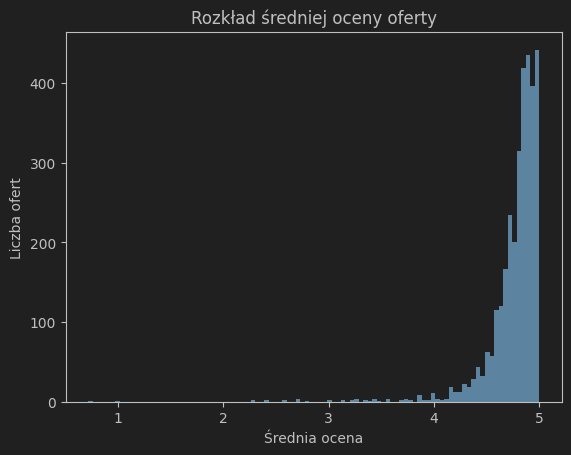

# Etap 1 - raport

* Definicja problemu biznesowego, zdefiniowanie zadania/zadań modelowania i wszystkich założeń, zaproponowania kryteriów
  sukcesu
* Analiza danych z perspektywy realizacji tych zadań (trzeba ocenić, czy dostarczone dane są wystarczające – może czegoś
  brakuje, może coś trzeba poprawić, domagać się innych danych, ...)

## Temat projektu

"Niewątpliwie nasza wyszukiwarka ofert jest najlepsza w branży, jednakże jakiś czas temu okazało się, że nowo dodane
oferty są słabo pozycjonowane przez silnik wyszukujący. Czy da się coś z tym zrobić?"

## Definicja problemu biznesowego

### Problem biznesowy

* Opracowanie sposobu pozycjonowania w wynikach wyszukiwania ofert, które nie mają jeszcze żadnych opinii
    * obecnie oferty bez opinii nie są w ogóle pozycjonowane
    * nie ma punktu odniesienia dla naszego rozwiązania

### Założenia

* Wyszukiwarka działa dobrze dla ofert, które mają jakieś oceny
* W zbiorze danych `listings.csv` mamy parametry ofert oraz ich średnie oceny w różnych kategoriach
* Do pozycjonowania ofert służy średnia ocena ze wszystkich kategorii - do weryfikacji!
* Dla użytkownika średnia ocena jest bardzo dobrym kryterium jakości oferty
* Możemy przewidzieć oceny dla tych ofert, gdzie ich brakuje
* Chcemy, żeby system mając dwie oferty - jedna z rzeczywistą średnią ocen $y$, druga z przewidzianą średnią oceną $y$
  wyżej pozycjonował ofertę z rzeczywistą średnią oceną $y$

### Zadanie modelowania

* Zadanie regresji - przewidywanie średniej oceny oferty na podstawie parametrów oferty
* Cel - średnia ocena - średnia z kolumn:
    * `review_scores_rating`
    * `review_scores_accuracy`
    * `review_scores_cleanliness`
    * `review_scores_checkin`
    * `review_scores_communication`
    * `review_scores_location`
    * `review_scores_value`
* Predykcję oceny możemy przemnożyć przez wagę $\in (0, 1]$ żeby oferty o rzeczywistej średniej ocenie jednakowej
  wartości były lepiej pozycjonowane
* Model bazowy
    * losowy model bazowy - przewidujemy średnią ocenę jako losową wartość z rozkładu normalnego
    * rozkład normalny z parametrami:
        * $\mu = 4.77$
        * $\sigma = 0.27$

### Biznesowe kryteria sukcesu

* Wzrost liczby wyświetleń ofert bez dodanych opinii do poziomu $\ge 50\%$ średniej liczby wyświetleń ofert z dodanymi
  opiniami

### Analityczne kryteria sukcesu

* Błąd średniokwadratowy $MSE$ na zbiorze testowym 5? razy mniejszy niż dla losowego modelu bazowego

## Analiza danych

### Dostępne zbiory danych

* `calendar.csv`
    * kalendarz dostępności ofert
    * nieprzydatny do naszego zadania
* `reviews.csv`
    * tekstowe opinie do ofert
    * nieprzydatne do naszego zadania
* `listings.csv`
    * parametry ofert
    * wiele atrybutów, które mogą posłużyć za wejście modelu
    * średnie oceny ofert w różnych kategoriach
    * możemy potraktować średnią z ocen we wszystkich kategoriach jako cel regresji

### Analiza zbioru `listings.csv`

#### Wielkość zbioru danych

* Wiersze: 4195
* Wiersze z ocenami: 3223

#### Wszystkie atrybuty

* `id`
* `listing_url`
* `scrape_id`
* `last_scraped`
* `source`
* `name`
* `description`
* `neighborhood_overview`
* `picture_url`
* `host_id`
* `host_url`
* `host_name`
* `host_since`
* `host_location`
* `host_about`
* `host_response_time`
* `host_response_rate`
* `host_acceptance_rate`
* `host_is_superhost`
* `host_thumbnail_url`
* `host_picture_url`
* `host_neighbourhood`
* `host_listings_count`
* `host_total_listings_count`
* `host_verifications`
* `host_has_profile_pic`
* `host_identity_verified`
* `neighbourhood`
* `neighbourhood_cleansed`
* `neighbourhood_group_cleansed`
* `latitude`
* `longitude`
* `property_type`
* `room_type`
* `accommodates`
* `bathrooms`
* `bathrooms_text`
* `bedrooms`
* `beds`
* `amenities`
* `price`
* `minimum_nights`
* `maximum_nights`
* `minimum_minimum_nights`
* `maximum_minimum_nights`
* `minimum_maximum_nights`
* `maximum_maximum_nights`
* `minimum_nights_avg_ntm`
* `maximum_nights_avg_ntm`
* `calendar_updated`
* `has_availability`
* `availability_30`
* `availability_60`
* `availability_90`
* `availability_365`
* `calendar_last_scraped`
* `number_of_reviews`
* `number_of_reviews_ltm`
* `number_of_reviews_l30d`
* `first_review`
* `last_review`
* `review_scores_rating`
* `review_scores_accuracy`
* `review_scores_cleanliness`
* `review_scores_checkin`
* `review_scores_communication`
* `review_scores_location`
* `review_scores_value`
* `license`
* `instant_bookable`
* `calculated_host_listings_count`
* `calculated_host_listings_count_entire_homes`
* `calculated_host_listings_count_private_rooms`
* `calculated_host_listings_count_shared_rooms`
* `reviews_per_month`

#### Całkiem nieprzydatne atrybuty

Atrybuty, które możemy odrzucić, bo nie niosą informacji, są bardzo niezbalansowanymi kategoriami,
mają nieprzydatny format itd.

* `id`
    * nie niesie informacji o jakości
* `listing_url`
    * powiązany z id
* `scrape_id`
    * nie powinno być istotne, kiedy zostały zebrane dane
* `last_scraped`
    * wynika ze `scrape_id`
* `source`
    * związane z procesem zbierania danych
* `picture_url`
    * nie mamy jak tego wykorzystać, chyba że pobierać każdy i analizować metodami CV
    * brak obrazka może być istotny
    * w zbiorze nie ma przykładów z brakującym obrazkiem
* `host_id`
    * nie niesie informacji o jakości
    * odrzucane po wyciągnięciu średniej oceny dla hosta
* `host_url`
    * nie niesie informacji o jakości
* `host_name`
    * nie niesie informacji o jakości
* `host_location`
    * miasto i państwo lub miasto i stan USA
    * 200 różnych
    * ~75% to `Berlin, Germany`
    * można wyciągnąć państwo
    * 42 różne
    * ponad 3000 to Niemcy, kolejne USA ma 28
    * raczej nieprzydatne, bo dużo unikalnych wartości i jedna wyraźnie dominuje
* `host_thumbnail_url`
    * brak miniaturki może być istotny
    * tylko 3 braki w całym zbiorze
* `host_picture_url`
    * brak zdjęcia może być istotny - jest na to oddzielny atrybut
    * tylko 3 braki w całym zbiorze
* `host_neighbourhood`
    * 104 unikalne wartości - raczej za dużo
* `neighbourhood`
    * nominalny
    * bezużyteczny - `Berlin, Germany` występuje 2043 razy
    * każda z pozostałych 12 kategorii też zawiera `Berlin, Germany` i występuje po 1 raz
* `neighbourhood_cleansed`
    * 133 unikalne wartości - raczej za dużo
    * `neighbourhood_group_cleansed` jest powiązany i powinien być bardziej informatywny
* `latitude`
    * surowe współrzędne nie będą użyteczne przy regresji
    * `neighbourhood_group_cleansed` zawiera informację o lokalizacji
* `longitude`
    * surowe współrzędne nie będą użyteczne przy regresji
    * `neighbourhood_group_cleansed` zawiera informację o lokalizacji
* `amenities`
    * lista wszystkich udogodnień
    * potencjalnie bardzo przydatne
    * unikalnych wartości w listach jest ponad 1000
    * można spróbować one-hot encoding i zamienić na zanurzenie w modelu neuronowym
* `calendar_updated`
    * braki we wszystkich wierszach
* `calendar_last_scraped`
    * związane z procesem zbierania danych
* `first_review`
    * nie będzie dostępny dla nowych ofert
* `last_review`
    * nie będzie dostępny dla nowych ofert
* `reviews_per_month`
    * nie będzie dostępny dla nowych ofert

#### Atrybuty tekstowe

Atrybuty nieprzydatne w takiej postaci, ale można by je przetworzyć przez LLM i uzyskać zanurzenia

* `name`
    * można by wyciągnąć informację o typie oferty, ale na to już jest atrybut
* `description`
    * potencjalnie bardzo przydatne
    * można by utworzyć zanurzenie jakimś zewnętrznym modelem
    * 185 braków
* `neighborhood_overview`
    * ~50% braków
* `host_about`
    * ~50% braków
    * wątpliwe czy w ogóle zawiera przydatne informacje
* `license`
    * ~40% braków
    * wątpliwe czy w ogóle zawiera przydatne informacje

#### Atrybuty binarne

Wartości `t`/`f` zamieniamy na 0/1

* `host_is_superhost`
* `host_has_profile_pic`
* `host_identity_verified`
* `has_availability`
* `instant_bookable`

#### Oceny

* Średnia z tych atrybutów jest celem regresji
* Kolumny
    * `review_scores_rating`
    * `review_scores_accuracy`
    * `review_scores_cleanliness`
    * `review_scores_checkin`
    * `review_scores_communication`
    * `review_scores_location`
    * `review_scores_value`
* Brak w 23% wierszy
* Rozkład normalny
    * średnia $\mu = 4.77$
    * odchylenie $\sigma = 0.27$
    * obcięty w $5.0$
    * możemy wykorzystać rozkład tworząc losowy model bazowy

#### Atrybuty - listy

Wartości w postaci `["Heating", "Washer", "Kitchen", "Wifi"]`.
Możemy wyciągnąć unikalne wartości i zastosować one-hot encoding.

* `amenities`
    * opisane w Całkiem nieprzydatne atrybuty
* `host_verifications`
    * 4 unikalne wartości atrybutu - możemy wykorzystać

#### Atrybuty kategoryczne

* `host_response_time`
    * porządkowy
    * możemy przypisać wartości liczbowe?
* `neighbourhood_group_cleansed`
    * 12 klas, możemy wykorzystać z one-hot encoding
* `property_type`
    * 47 klas
    * większość bardzo mało liczna
    * wiele podobnych do siebie
    * dominuje (ponad 50%) `Entire rental unit`
    * możemy pogrupować podobne klasy i zbiorczą klasę `other`, a potem one-hot encoding
* `room_type`
    * 4 klasy
    * 2 bardzo mniejszościowe
    * możemy zastosować one-hot-encoding
    * może połączyć dwie mniejsze klasy?
* `bathrooms_text`
    * liczba i tekst
    * liczba łazienek, ale czemu są ułamkowe? (np. 1.5)
    * można wyciągnąć liczbę jako oddzielny atrybut TODO
    * można z tekstu wyciągnąć czy łazienka jest dzielona (atrybut binarny) - wydaje się istotne

#### Inne atrybuty wymagające przekształcenia

* `host_since`
    * znacznik czasowy
    * możemy zamienić na liczbę lat od teraz - sensowny rozkład
* `host_response_rate`
    * procent - możemy zamienić na liczbę $\in [0,1]$
* `host_acceptance_rate`
    * procent - możemy zamienić na liczbę $\in [0,1]$
* `price`
    * część jako liczba, część jako napis z symbolem dolara
    * zamieniamy wszystkie na liczbę
    * wydaje się bardzo istotny a ma 36% brakujących wartości (tam, gdzie nie brakuje oceny - nasz zbiór treningowy)

#### Dodatkowe atrybuty

* Średnia pozostałych ogłoszeń użytkownika (`avg_rating_by_host`)

#### Nieruszone atrybuty

* Atrybuty liczbowe, możemy je wykorzystać bezpośrednio w modelu
    * `maximum_nights`
    * `minimum_minimum_nights`
    * `maximum_minimum_nights`
    * `minimum_maximum_nights`
    * `maximum_maximum_nights`
    * `minimum_nights_avg_ntm`
    * `maximum_nights_avg_ntm`
    * `availability_30`
    * `availability_60`
    * `availability_90`
    * `availability_365`
    * `number_of_reviews`
    * `number_of_reviews_ltm`
    * `number_of_reviews_l30d`
    * `calculated_host_listings_count`
    * `calculated_host_listings_count_entire_homes`
    * `calculated_host_listings_count_private_rooms`
    * `calculated_host_listings_count_shared_rooms`

* TODO Musimy dokonać selekcji, mogłem przeoczyć jakieś, które są liczbowe, a nie mają sensu

#### Brakujące wartości atrybutów

* Procent w wyczyszczonych danych (skrypt [listings_preprocessing.py](../listings_preprocessing.py)).
* W wierszach gdzie średnia ocena jest znana - na tym zbiorze możemy trenować model.
* Kolumny, w których mamy braki wydają się bardzo istotne dla jakości oferty - to może być problem przy modelowaniu.
* Mamy za mało danych i braków jest zbyt dużo, żeby odrzucać wiersze z brakami atrybutów
    * rozważamy uzupełnienie braków pomocniczym modelem regresji obsługującym brakujące wartości (np. las losowy)
* Brak `price`, `beds`, `bathrooms` występuje jednocześnie
    * jest mocno skorelowany z brakami w reszcie atrybutów

| Atrybut              | % brakujących wartości |
|----------------------|------------------------|
| price                | 0.36                   |
| beds                 | 0.36                   |
| bathrooms            | 0.36                   |
| host_response_time   | 0.35                   |
| host_response_rate   | 0.35                   |
| host_acceptance_rate | 0.27                   |
| bedrooms             | 0.14                   |

#### Korelacja atrybutów liczbowych i średniej opinii

| Atrybut                                          | Współczynnik korelacji |
|--------------------------------------------------|------------------------|
| **avg_rating_by_host**                           | 0.812079               |
| **calculated_host_listings_count**               | -0.254694              |
| **calculated_host_listings_count_entire_homes**  | -0.242170              |
| **maximum_minimum_nights**                       | -0.164190              |
| **calculated_host_listings_count_private_rooms** | -0.143124              |
| **availability_365**                             | -0.139259              |
| **availability_30**                              | -0.114143              |
| **availability_60**                              | -0.110936              |
| **availability_90**                              | -0.108025              |
| minimum_minimum_nights                           | -0.087439              |
| maximum_nights                                   | -0.086410              |
| maximum_maximum_nights                           | -0.083740              |
| minimum_nights_avg_ntm                           | -0.080875              |
| maximum_nights_avg_ntm                           | -0.075058              |
| minimum_maximum_nights                           | -0.061483              |
| number_of_reviews_l30d                           | 0.056563               |
| number_of_reviews_ltm                            | 0.055173               |
| number_of_reviews                                | 0.041431               |
| price                                            | 0.036055               |
| calculated_host_listings_count_shared_rooms      | -0.034583              |

#### Współczynnik informacji wzajemnej między atrybutami liczbowymi i średnią opinią

| Atrybut                                      | Wsp. informacji wzajemnej |
|----------------------------------------------|---------------------------|
| avg_rating_by_host                           | 3.226074                  |
| number_of_reviews                            | 0.475701                  |
| number_of_reviews_ltm                        | 0.190932                  |
| maximum_nights                               | 0.082074                  |
| calculated_host_listings_count_entire_homes  | 0.080205                  |
| calculated_host_listings_count               | 0.071988                  |
| availability_365                             | 0.067038                  |
| maximum_nights_avg_ntm                       | 0.065238                  |
| maximum_maximum_nights                       | 0.058819                  |
| minimum_nights_avg_ntm                       | 0.055982                  |
| minimum_maximum_nights                       | 0.048532                  |
| minimum_minimum_nights                       | 0.044014                  |
| availability_30                              | 0.042572                  |
| number_of_reviews_l30d                       | 0.042106                  |
| availability_60                              | 0.041981                  |
| calculated_host_listings_count_private_rooms | 0.036400                  |
| calculated_host_listings_count_shared_rooms  | 0.030120                  |
| availability_90                              | 0.022099                  |
| price                                        | 0.013473                  |
| maximum_minimum_nights                       | 0.000000                  |

##### Wnioski

* `avg_rating_by_host` jest świetnym przybliżeniem etykiety, dostępne niestety tylko dla 20% wierszy, dla których
  nie mamy informacji o ocenie
* Dużo informacji o średniej ocenie niesie liczba recenzji, która niestety niezerowa jest w tym samym przypadku,
  co `avg_rating_by_host`
* Korelacja liniowa wydaje się być nienajgorsza dla kilku atrybutów, jednak współczynnik informacji wzajemnej jest
  znacznie niższy
* Nie mamy zaskakująco dobrych atrybutów poza sztucznie utworzonym, potencjalnie ew.
  `calculated_host_listings_count_entire_homes`
